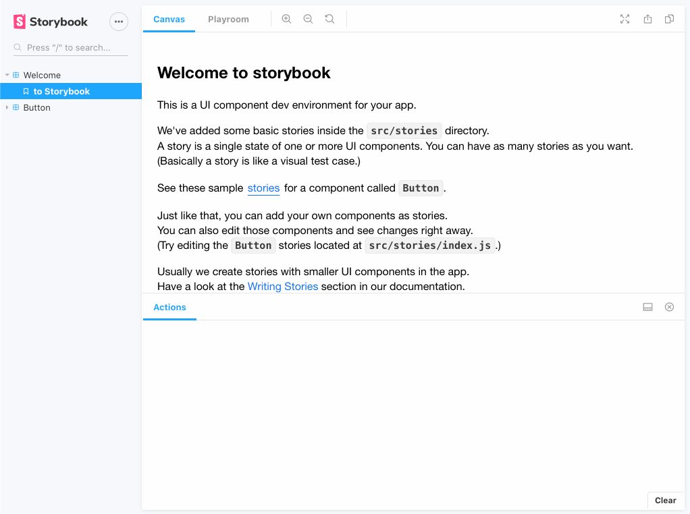

# Storybook Playroom Addon

[](https://www.npmjs.com/package/storybook-addon-playroom)
[](https://github.com/rbardini/storybook-addon-playroom/actions)
[](https://libraries.io/npm/storybook-addon-playroom)

🧩 Design with [Playroom](https://github.com/seek-oss/playroom) inside [Storybook](https://storybook.js.org), using each story source as a starting point.



[View demo →](https://storybook-addon-playroom.rbrd.in)

## Getting started

> **Note:** Playroom must be set up and running before using this addon, see [instructions](https://github.com/seek-oss/playroom#getting-started).

```console
npm install --save-dev storybook-addon-playroom
```

```js
// .storybook/main.js
export default {
  addons: ['storybook-addon-playroom'],
}
```

## Configuration

The addon can be configured via the `playroom` [parameter](https://storybook.js.org/docs/react/writing-stories/parameters). The following options are available:

| Option                           | Type      | Description                                          | Default                 |
| :------------------------------- | :-------- | :--------------------------------------------------- | :---------------------- |
| `url`                            | `string`  | the Playroom URL                                     | `http://localhost:9000` |
| `code`                           | `string`  | code to be used instead of story source              |                         |
| `disable`                        | `boolean` | whether to disable the addon                         | `false`                 |
| `includeDecorators`              | `boolean` | whether to include global decorators in stories code | `false`                 |
| `reactElementToJSXStringOptions` | `object`  | [react-element-to-jsx-string options][1]             | `{ sortProps: false }`  |

To configure for all stories, set the `playroom` parameter in [`.storybook/preview.js`](https://storybook.js.org/docs/react/configure/overview#configure-story-rendering):

```js
export const parameters = {
  playroom: {
    url: 'http://localhost:9000',
  },
}
```

You can also configure on per-story or per-component basis using [parameter inheritance](https://storybook.js.org/docs/react/writing-stories/parameters#component-parameters):

```jsx
// Button.stories.js

// Use predefined code instead of story source in all Button stories
export default {
  title: 'Button',
  parameters: {
    playroom: {
      code: '<Button>Hello Button</Button>',
    },
  },
}

// Disable addon in Button/Large story only
export const Large = Template.bind({})
Large.parameters = {
  playroom: {
    disable: true,
  },
}
```

> **Note:** Disabling the addon does not hide the _Playroom_ tab from preview. For that, you must use Storybook's own [`previewTabs`](https://github.com/storybookjs/storybook/pull/9095) parameter:

```js
Story.parameters = {
  previewTabs: {
    'storybook/playroom/panel': {
      hidden: true,
    },
  },
}
```

[1]: https://github.com/algolia/react-element-to-jsx-string#reactelementtojsxstringreactelement-options
