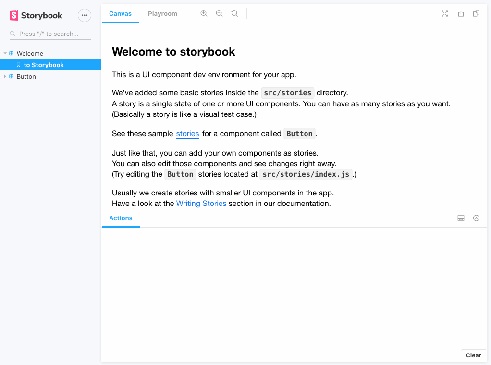

# Storybook Playroom Addon

[](https://www.npmjs.com/package/storybook-addon-playroom)
[](https://github.com/rbardini/storybook-addon-playroom/actions)
[](https://libraries.io/npm/storybook-addon-playroom)

🧩 Design with [Playroom](https://github.com/seek-oss/playroom) from [Storybook](https://storybook.js.org), using each story source as a starting point.



[View demo →](https://storybook-addon-playroom.rbrd.in)

## Getting started

> **Note:** Playroom must be set up and running before using this addon, see [instructions](https://github.com/seek-oss/playroom#getting-started).

```console
npm install --save-dev storybook-addon-playroom
```

Register the addon in `.storybook/main.ts`:

```ts
// .storybook/main.ts

// Replace your-framework with the framework you are using (e.g., react-vite, nextjs-vite)
import { defineMain } from '@storybook/your-framework/node'

export default defineMain({
  // ...rest of config
  addons: ['storybook-addon-playroom'],
})
```

Register the addon's preview annotations in `.storybook/preview.ts`:

```ts
// .storybook/preview.ts

// Replace your-framework with the framework you are using (e.g., react-vite, nextjs-vite)
import { definePreview } from '@storybook/your-framework'

import playroom from 'storybook-addon-playroom'

export default definePreview({
  // ...rest of preview
  addons: [playroom()], // 👈 register the addon here
})
```

## Configuration

The addon can be configured via the `playroom` [parameter](https://storybook.js.org/docs/writing-stories/parameters). The following options are available:

| Option                           | Type      | Description                                          | Default                 |
| :------------------------------- | :-------- | :--------------------------------------------------- | :---------------------- |
| `url`                            | `string`  | the Playroom URL                                     | `http://localhost:9000` |
| `code`                           | `string`  | code to be used instead of story source              |                         |
| `disable`                        | `boolean` | whether to disable the addon                         | `false`                 |
| `includeDecorators`              | `boolean` | whether to include global decorators in stories code | `false`                 |
| `reactElementToJSXStringOptions` | `object`  | [react-element-to-jsx-string options][1]             | `{ sortProps: false }`  |

To configure for all stories, set the `playroom` [parameter](https://storybook.js.org/docs/configure):

```ts
// .storybook/preview.ts

export default definePreview({
  parameters: {
    playroom: {
      url: 'http://localhost:9000',
    },
  },
})
```

You can also configure on per-story or per-component basis using [parameter inheritance](https://storybook.js.org/docs/writing-stories/parameters#component-parameters):

```tsx
// Button.stories.ts

import preview from '../.storybook/preview'

import { Button } from './Button'

// Set predefined code for all Button stories
const meta = preview.meta({
  title: 'Button',
  component: Button,
  parameters: {
    playroom: {
      // Use predefined code instead of story source on all Button stories
      code: '<Button>Hello Button</Button>',
    },
  },
})

// Disable addon in Button/Large story only
export const Large = meta.story({
  args: {
    size: 'large',
  },
  parameters: {
    playroom: {
      disable: true,
    },
  },
})
```

## FAQ

### Why does my generated Playroom code contain nonsensical component names?

If you see mangled component names like `<O />` instead of `<Card />`, you may need to [customize Storybook's Vite setup](https://storybook.js.org/docs/api/main-config/main-config-vite-final) and [disable minification](https://vitejs.dev/config/build-options#build-minify):

```ts
// .storybook/main.ts

import { defineMain } from '@storybook/your-framework/node'
import { mergeConfig } from 'vite'

export default defineMain({
  addons: ['storybook-addon-playroom'],
  async viteFinal(config) {
    return mergeConfig(config, {
      build: {
        // Disable minification
        minify: false,
      },
    })
  },
})
```

[1]: https://github.com/algolia/react-element-to-jsx-string#reactelementtojsxstringreactelement-options
